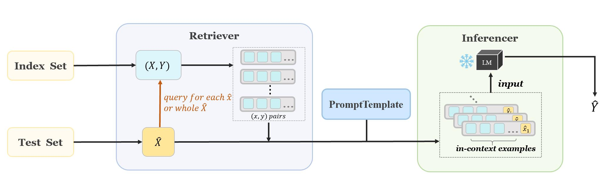

:github_url: https://github.com/Shark-NLP/OpenICL

OpenICL Documentation
===================================
.. figure:: img/openicl.png

**OpenICL** is an open-source framework to facilitate research, development, and prototyping of in-context learning.

   Overview of the architecture in OpenICL.

It provides an easy interface for in-context learning, with many state-of-the-art retrieval and inference methods built in to facilitate systematic comparison of LMs and fast research prototyping. Users can easily incorporate different retrieval and inference methods, as well as different prompt instructions into their workflow.

.. note::

   This project is under active development.

Citation
--------

If you find this repository helpful, feel free to cite our paper: 

.. code-block:: bibtex
   
   @article{wu2023openicl,
   title={OpenICL: An Open-Source Framework for In-context Learning},
   author={Zhenyu Wu, Yaoxiang Wang, Jiacheng Ye, Jiangtao Feng, Jingjing Xu, Yu Qiao, Zhiyong Wu},
   journal={arXiv preprint arXiv:2303.02913},
   year={2023}
   }

.. toctree::
   :glob:
   :maxdepth: 3
   :caption: Getting Started

   notes/installation
   notes/example

.. toctree::
   :glob:
   :maxdepth: 3
   :caption: Tutorials

   notes/tutorial
   

.. toctree::
   :glob:
   :maxdepth: 2
   :caption: Modules

   modules/dataset_reader
   modules/prompt_template
   modules/inferencer/inferencer_link
   modules/retriever/retriever_link

Indices and tables
==================

* :ref:`genindex`
* :ref:`search`
